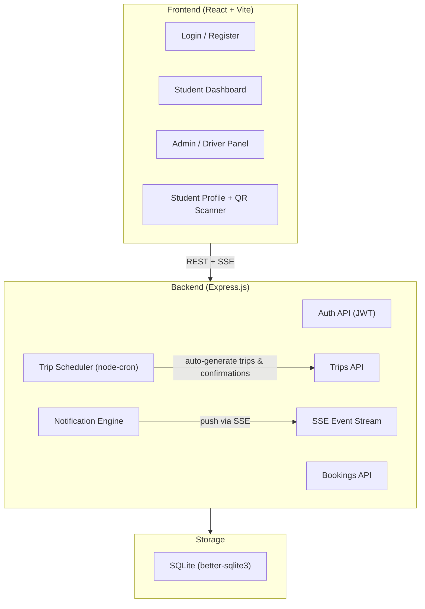

# 42 Bus Booking — Full-Stack Web Application

A student bus booking system for 42 School with email/password auth (restricted to `learner.42.tech` domain), real-time seat tracking, QR attendance, and an admin/driver panel.

---

## Architecture Overview



### Tech Stack

| Layer | Technology | Rationale |
|-------|-----------|-----------|
| Frontend | React 19 + Vite | Fast dev, HMR, modern tooling |
| Styling | Vanilla CSS (custom design system) | Full control, no dependency bloat |
| Backend | Express.js (Node) | Simple, proven, pairs well with SQLite |
| Database | SQLite via `better-sqlite3` | Zero-config, synchronous, fast, perfect for MVP |
| Auth | JWT + bcrypt | Stateless auth, secure password hashing |
| Real-time | Server-Sent Events (SSE) | Simpler than WebSockets, sufficient for one-way push |
| QR Generate | `qrcode` npm package | Server-side QR generation |
| QR Scan | `html5-qrcode` | Browser camera-based QR scanning |
| Maps | Leaflet.js + react-leaflet | Interactive maps with markers |
| Scheduling | `node-cron` | Automated trip generation & confirmation |
| Icons | `lucide-react` | Consistent, lightweight icon set |

---

## User Review Required

> [!IMPORTANT]
> **Pickup Points**: I'll use 4 placeholder pickup points around Irbid, Jordan (based on coordinates in the test project `32.5532, 35.8500`). Please confirm the actual 4 pickup point names and coordinates you want.

> [!IMPORTANT]
> **Driver Account**: The driver/admin account will be created via a seed script or by registering with a special admin email. I'll use the approach of having a config flag — any email in an `ADMIN_EMAILS` env variable gets admin role. Please confirm this approach.

> [!WARNING]
> **No External Database**: This MVP uses SQLite stored as a file on the server. This means it works great for a single-server deployment (e.g., a VPS, Railway, Render) but NOT for serverless platforms like Netlify Functions or Vercel Edge. If you need serverless, we'd switch to PostgreSQL (Supabase/Neon).

---

## Proposed Changes

### Project Structure

```
42 bus website/
├── package.json
├── vite.config.js
├── index.html
├── server/
│   ├── index.js              # Express entry point
│   ├── db.js                 # SQLite setup + schema
│   ├── seed.js               # Seed pickup points + time slots
│   ├── middleware/
│   │   └── auth.js           # JWT verification middleware
│   ├── routes/
│   │   ├── auth.js           # Register / Login
│   │   ├── trips.js          # Trip CRUD + auto-generation
│   │   ├── bookings.js       # Booking/cancel/attendance
│   │   ├── notifications.js  # SSE stream + notification list
│   │   └── admin.js          # Driver panel endpoints
│   ├── services/
│   │   ├── scheduler.js      # node-cron jobs
│   │   ├── tripEngine.js     # Weighted avg calc, auto-gen logic
│   │   └── notifier.js       # SSE broadcast + notification creation
│   └── utils/
│       └── qr.js             # QR code generation
├── src/
│   ├── main.jsx
│   ├── App.jsx
│   ├── index.css             # Full design system
│   ├── contexts/
│   │   ├── AuthContext.jsx    # Auth state + JWT management
│   │   └── NotificationContext.jsx  # SSE connection + notifications
│   ├── components/
│   │   ├── Navbar.jsx
│   │   ├── ProtectedRoute.jsx
│   │   ├── NotificationBell.jsx
│   │   ├── NotificationPanel.jsx
│   │   ├── TripCard.jsx
│   │   ├── SeatIndicator.jsx
│   │   ├── BookingForm.jsx
│   │   ├── QRScanner.jsx
│   │   ├── QRDisplay.jsx
│   │   ├── MapView.jsx
│   │   └── PickupPointList.jsx
│   └── pages/
│       ├── Login.jsx
│       ├── Register.jsx
│       ├── StudentDashboard.jsx
│       ├── StudentProfile.jsx
│       ├── AdminDashboard.jsx
│       └── AdminTripDetail.jsx
└── public/
```

---

### Phase 1: Project Initialization & Database

#### [NEW] package.json
- Dependencies: `react`, `react-dom`, `react-router-dom`, `leaflet`, `react-leaflet`, `lucide-react`, `html5-qrcode`
- Backend deps: `express`, `better-sqlite3`, `bcryptjs`, `jsonwebtoken`, `qrcode`, `node-cron`, `cors`, `uuid`
- Scripts: `dev` (Vite), `dev:server` (Express on port 3001), `dev:all` (concurrently)

#### [NEW] server/db.js
SQLite schema with tables:

```sql
-- Users table
CREATE TABLE users (
  id INTEGER PRIMARY KEY AUTOINCREMENT,
  email TEXT UNIQUE NOT NULL,
  password_hash TEXT NOT NULL,
  name TEXT NOT NULL,
  role TEXT DEFAULT 'student',  -- 'student' | 'admin'
  warnings INTEGER DEFAULT 0,
  banned_until TEXT,            -- ISO date string
  created_at TEXT DEFAULT (datetime('now'))
);

-- Pickup Points (seeded)
CREATE TABLE pickup_points (
  id INTEGER PRIMARY KEY AUTOINCREMENT,
  name TEXT NOT NULL,
  lat REAL NOT NULL,
  lng REAL NOT NULL,
  order_index INTEGER,          -- order of arrival
  eta_minutes INTEGER           -- estimated minutes from 42
);

-- Time Slots (driver-configured)
CREATE TABLE time_slots (
  id INTEGER PRIMARY KEY AUTOINCREMENT,
  hour INTEGER NOT NULL,        -- 9, 10, 11, ...
  is_active INTEGER DEFAULT 1
);

-- Trips
CREATE TABLE trips (
  id INTEGER PRIMARY KEY AUTOINCREMENT,
  direction TEXT NOT NULL,       -- 'to_42' | 'from_42'
  date TEXT NOT NULL,            -- '2026-04-10'
  time_slot_id INTEGER,
  calculated_departure TEXT,     -- actual calculated time (weighted avg)
  status TEXT DEFAULT 'pending', -- 'pending' | 'confirmed' | 'started' | 'completed'
  qr_token TEXT,                 -- unique token for QR attendance
  seats_total INTEGER DEFAULT 25,
  created_at TEXT DEFAULT (datetime('now')),
  FOREIGN KEY (time_slot_id) REFERENCES time_slots(id)
);

-- Bookings
CREATE TABLE bookings (
  id INTEGER PRIMARY KEY AUTOINCREMENT,
  trip_id INTEGER NOT NULL,
  user_id INTEGER NOT NULL,
  pickup_point_id INTEGER NOT NULL,
  status TEXT DEFAULT 'booked',  -- 'booked' | 'confirmed' | 'attended' | 'no_show' | 'cancelled'
  booked_at TEXT DEFAULT (datetime('now')),
  FOREIGN KEY (trip_id) REFERENCES trips(id),
  FOREIGN KEY (user_id) REFERENCES users(id),
  FOREIGN KEY (pickup_point_id) REFERENCES pickup_points(id),
  UNIQUE(trip_id, user_id)
);

-- Notifications
CREATE TABLE notifications (
  id INTEGER PRIMARY KEY AUTOINCREMENT,
  user_id INTEGER,              -- NULL = broadcast to all
  type TEXT NOT NULL,            -- 'trip_confirmed' | 'trip_started' | 'cancellation' | 'warning' | 'ban' | 'broadcast'
  title TEXT NOT NULL,
  message TEXT NOT NULL,
  is_read INTEGER DEFAULT 0,
  created_at TEXT DEFAULT (datetime('now')),
  FOREIGN KEY (user_id) REFERENCES users(id)
);
```

#### [NEW] server/seed.js
Seeds 4 pickup points and default time slots (9 AM – 3 PM).

---

### Phase 2: Authentication

#### [NEW] server/routes/auth.js
| Endpoint | Method | Description |
|----------|--------|-------------|
| `/api/auth/register` | POST | Validate email domain `learner.42.tech`, hash password, create user |
| `/api/auth/login` | POST | Verify credentials, return JWT |
| `/api/auth/me` | GET | Return current user profile (requires JWT) |

#### [NEW] server/middleware/auth.js
- JWT verification middleware
- Extracts user from token, attaches to `req.user`
- Role-based guard: `requireAdmin` middleware

#### [NEW] src/contexts/AuthContext.jsx
- Stores JWT in localStorage
- Provides `login()`, `register()`, `logout()`, `user` state
- Auto-fetches `/api/auth/me` on app load

#### [NEW] src/pages/Login.jsx & Register.jsx
- Clean mobile-first forms
- Email domain validation on client side too
- Error display for invalid credentials

---

### Phase 3: Trip Management & Auto-Generation

#### [NEW] server/routes/trips.js
| Endpoint | Method | Auth | Description |
|----------|--------|------|-------------|
| `/api/trips` | GET | Student | List available trips (with seat counts) |
| `/api/trips/:id` | GET | Any | Get trip detail with bookings |
| `/api/trips/:id/status` | PATCH | Admin | Update trip status |

#### [NEW] server/services/tripEngine.js
- **Auto-generation**: When a `to_42` trip completes → generates tomorrow's same slot trip
- **Weighted average**: For each `to_42` trip, calculates optimal departure time based on which time slots students selected (e.g., if 15 students booked 9-10 and 5 booked 10-11, departure leans toward 9:15)
- **Registration window**: Opens when trip is created, closes 2 hours before departure

#### [NEW] server/services/scheduler.js
Cron jobs:
1. **Every minute**: Check if any trip's departure is ≤ 2 hours away → mark as `confirmed`, send notifications
2. **Every minute**: Check if any trip from 42 departs in ≤ 1 hour → broadcast notification to ALL students
3. **On trip completion**: Auto-generate next day's trip for same slot

---

### Phase 4: Booking System

#### [NEW] server/routes/bookings.js
| Endpoint | Method | Auth | Description |
|----------|--------|------|-------------|
| `/api/bookings` | POST | Student | Create booking (validates capacity, ban status, 2hr cutoff for to_42) |
| `/api/bookings` | GET | Student | Get my bookings |
| `/api/bookings/:id` | DELETE | Student | Cancel booking (validates 2hr cutoff) |
| `/api/bookings/:id/attend` | POST | Student | Mark attendance via QR token |

**Booking validation logic:**
- Check user isn't banned (`banned_until > now`)
- Check trip has available seats (< 25)
- Check user hasn't already booked this trip
- For `to_42` trips: check registration window is open (not within 2 hours of departure)
- For `from_42` trips: no time restriction

#### [NEW] src/pages/StudentDashboard.jsx
Two-tab layout:
- **Tab 1: Point → 42** — Shows available `to_42` trips with booking forms
- **Tab 2: 42 → Point** — Shows available `from_42` trips (always bookable)
- Each trip card shows: time slot, seats remaining (animated bar), pickup point selector, book button
- "My Bookings" section below with cancel buttons

---

### Phase 5: Real-Time (SSE)

#### [NEW] server/routes/notifications.js
| Endpoint | Method | Auth | Description |
|----------|--------|------|-------------|
| `/api/notifications/stream` | GET (SSE) | Any | SSE event stream for real-time updates |
| `/api/notifications` | GET | Student | List user's notifications |
| `/api/notifications/:id/read` | PATCH | Student | Mark notification as read |

#### [NEW] server/services/notifier.js
- Maintains a Map of `userId → response` for SSE connections
- `broadcast(event, data)` → pushes to all connected clients
- `notify(userId, event, data)` → pushes to specific user
- Events: `trip_update`, `booking_update`, `seat_update`, `notification`

#### [NEW] src/contexts/NotificationContext.jsx
- Opens SSE connection on login
- Listens for events, updates local state
- Provides notification list + unread count

#### [NEW] src/components/NotificationBell.jsx & NotificationPanel.jsx
- Bell icon with unread badge
- Dropdown panel listing recent notifications

---

### Phase 6: QR Attendance

#### [NEW] server/utils/qr.js
- Generates QR code as data URL from trip's unique `qr_token`
- Token format: `42bus:attend:{tripId}:{uuid}` (verified server-side)

#### [NEW] src/components/QRDisplay.jsx
- Shows QR code image on driver's trip detail page
- Auto-refreshes when trip status changes to "Started"

#### [NEW] src/components/QRScanner.jsx
- Uses `html5-qrcode` to access camera
- Scans QR, extracts token, calls `/api/bookings/:id/attend`
- Shows success/failure feedback

#### [NEW] src/pages/StudentProfile.jsx
- Student info (name, email, warnings count)
- "Scan QR" button that opens the scanner
- Booking history

**Attendance verification flow:**
1. Driver starts trip → backend generates `qr_token` for the trip
2. Driver's page shows QR code encoding `42bus:attend:{tripId}:{qr_token}`
3. Student opens profile → taps "Scan QR" → scans driver's QR
4. Frontend sends `POST /api/bookings/:id/attend` with `{ qr_token }`
5. Backend verifies: (a) token matches trip, (b) student has a booking for this trip, (c) trip status is "started"
6. Marks booking as `attended`

---

### Phase 7: Admin / Driver Panel

#### [NEW] server/routes/admin.js
| Endpoint | Method | Auth | Description |
|----------|--------|------|-------------|
| `/api/admin/trips` | GET | Admin | All trips with booking counts |
| `/api/admin/trips/:id` | GET | Admin | Trip detail with per-pickup-point breakdown |
| `/api/admin/trips/:id/start` | POST | Admin | Set trip to "started", generate QR |
| `/api/admin/trips/:id/complete` | POST | Admin | Set trip to "completed", process no-shows |
| `/api/admin/time-slots` | GET/POST | Admin | Manage time slots |

**No-show processing** (on trip complete):
- Any booking still in `booked` or `confirmed` status → marked `no_show`
- User receives warning notification, `warnings` count incremented
- If `warnings >= 3` → user banned for 2 days (`banned_until` set)

#### [NEW] src/pages/AdminDashboard.jsx
- Trip list with status badges: Pending (amber), Confirmed (blue), Started (green)
- Student count per trip
- Quick-action buttons: Confirm, Start, Complete

#### [NEW] src/pages/AdminTripDetail.jsx
- Trip info header with status workflow buttons
- QR code section (visible when status = "Started")
- Pickup point breakdown: 4 cards showing point name + student count
- Interactive Leaflet map with colored markers showing student count per pickup point
- Student list with attendance status

---

### Phase 8: UI / Design System

#### [NEW] src/index.css
Premium dark-mode design system:
- **Color palette**: Deep navy backgrounds (`#0a0e1a`, `#111827`), electric blue accents (`#3b82f6`), emerald greens for success, amber for warnings
- **Glass-morphism** panels with `backdrop-filter: blur()`
- **Typography**: Inter font from Google Fonts
- **Animations**: Smooth transitions, pulse effects on live seat counts, slide-in notifications
- **Mobile-first**: All layouts designed for 375px+ with responsive breakpoints

#### [NEW] src/components/Navbar.jsx
- App title + bus icon
- Navigation links (Dashboard, Profile)
- Notification bell
- User avatar/name + logout

#### [NEW] src/components/TripCard.jsx
- Visual seat availability bar (animated fill)
- Status badge with color coding
- Departure time with countdown
- Pickup point selector

---

## Open Questions

> [!IMPORTANT]
> **Pickup Point Locations**: What are the exact 4 pickup point names and GPS coordinates? I'll use placeholder Irbid locations if not specified.

> [!IMPORTANT]
> **Deployment Target**: Where will this be deployed? (VPS, Railway, Render, etc.) This affects the SQLite vs PostgreSQL decision. SQLite works perfectly for single-server deployments.

> [!NOTE]
> **Time Zone**: The server will operate in `Asia/Amman` (UTC+3) timezone for all scheduling. Confirm if this is correct.

---

## Verification Plan

### Automated Tests
1. `npm run dev:all` — Start both frontend (Vite on port 5173) and backend (Express on port 3001)
2. Test registration with valid and invalid email domains
3. Test booking flow: book → view → cancel
4. Test seat count real-time updates via SSE
5. Test trip auto-generation when a trip completes
6. Test QR attendance flow end-to-end
7. Test no-show → warning → ban flow
8. Test admin trip management (confirm → start → complete)

### Manual Verification
- Browser testing of all pages on mobile viewport (375px)
- QR scanner testing with device camera
- SSE notification delivery testing
- Map rendering with pickup point markers
